# mermaid-diagram

Скилл выдает валидный Mermaid-блок и парный ASCII/Unicode-сайдкар. Принцип: совместимость с минимальным набором рендереров (VS Code preview, GitHub/GitLab, embedded markdown viewers); экспериментальные типы (`quadrantChart`, `sankey-beta`, `requirementDiagram`, `gitGraph`) не используются - отдаются эквивалентные `graph`-фолбэки.

## Compatibility rules (read first)

- Использовать `graph LR` / `graph TB` для блок-схем; ключевое слово `flowchart` ломается в части старых рендереров.
- Лейблы со спецсимволами обязательно в кавычках: `A["Text (x|y)"]`.
- **Нельзя писать литеральный `\n` внутри лейблов** - Mermaid это не интерпретирует. Перенос строки - `<br/>`.
- Экспериментальные типы (`quadrantChart`, `sankey-beta`, `requirementDiagram`, `gitGraph`) могут быть недоступны - использовать готовые `graph`-фолбэки ниже.
- Code fence стартует с колонки 0, язык `mermaid`.

## ASCII/Unicode sidecar (обязательный)

Для удобства чтения в raw-Markdown и для агентов, которые не рендерят Mermaid, под каждым `mermaid`-блоком обязательно идет текстовый сайдкар.

Политика:

- MUST: monospace text-only диаграмма прямо под Mermaid-блоком, fenced code с языком `text`.
- MUST: Mermaid и сайдкар держим синхронными (одни и те же узлы/ребра/лейблы по возможности). При расхождении источник истины - Mermaid; обновить сайдкар.
- SHOULD: ширина <= 80 колонок (читаемость в diff и терминалах).
- SHOULD: ASCII-приоритет, Unicode box-drawing - только если окружение это поддерживает.
- MAY: однострочный заголовок над парой: `Diagram: <name> (<type>)`.

Примитивы для сайдкара:

- Боксы: `[Name]`, `(Name)`, `+-----+\n| N |\n+-----+`.
- Потоки: `-->`, решения как `{cond?}`, списки `-`.
- Sequence text: `Actor -> Actor: message` с отступами под lifeline.

Пример flowchart:

```mermaid
graph LR
  A["Start"] --> B{Auth?}
  B -->|Yes| C["Dashboard"]
  B -->|No|  D["Login"]
```

```text
Diagram: Auth flow (flowchart)
  [Start] --> {Auth?}
      {Auth?} -- Yes --> [Dashboard]
      {Auth?} -- No  --> [Login]
```

Пример sequence:

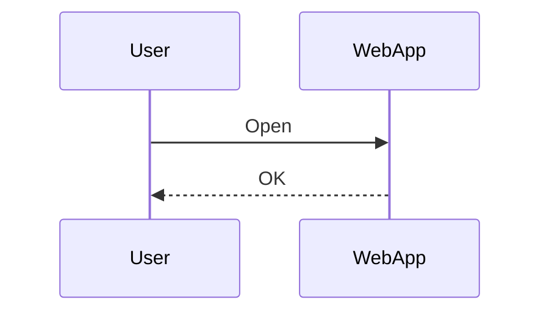

```text
Diagram: Happy path (sequence)
  User -> WebApp : Open
  WebApp -> User : OK
```

## Working templates

### Flowchart

```mermaid
graph LR
  A["Start"] --> B{Auth?}
  B -->|Yes| C["Dashboard"]
  B -->|No|  D["Login"]
  C --> E["Settings"]
```

### Sequence

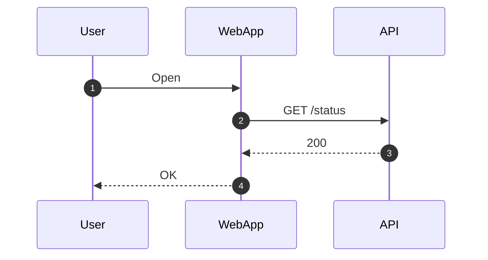

### Class

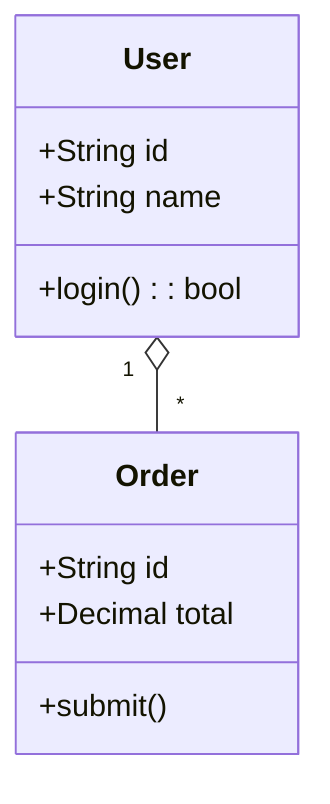

### State (v2)

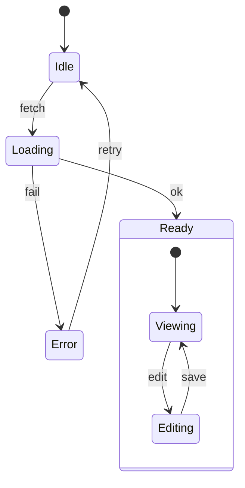

### ER (Entity-Relationship)

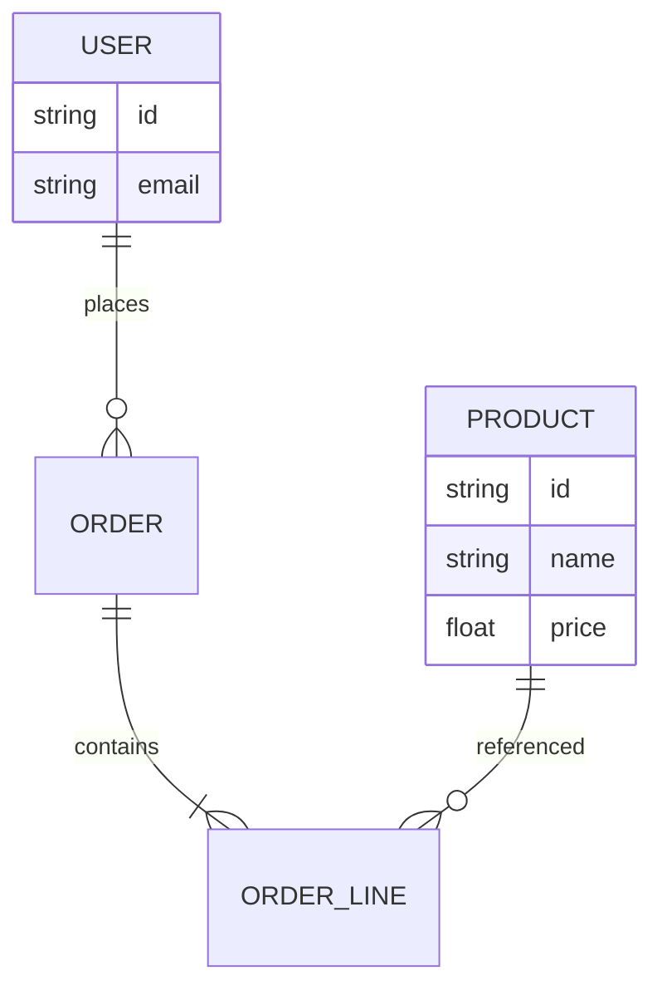

### Journey (user journey)

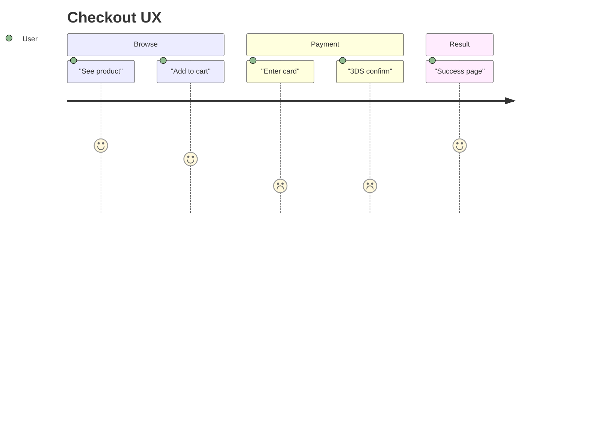

### Gantt

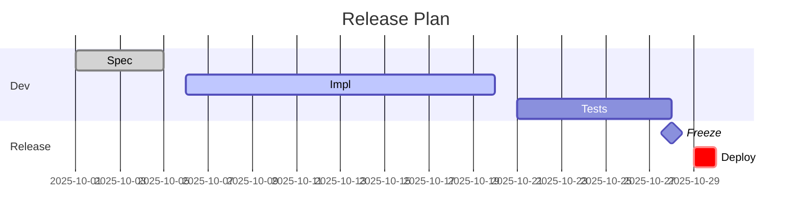

### Pie

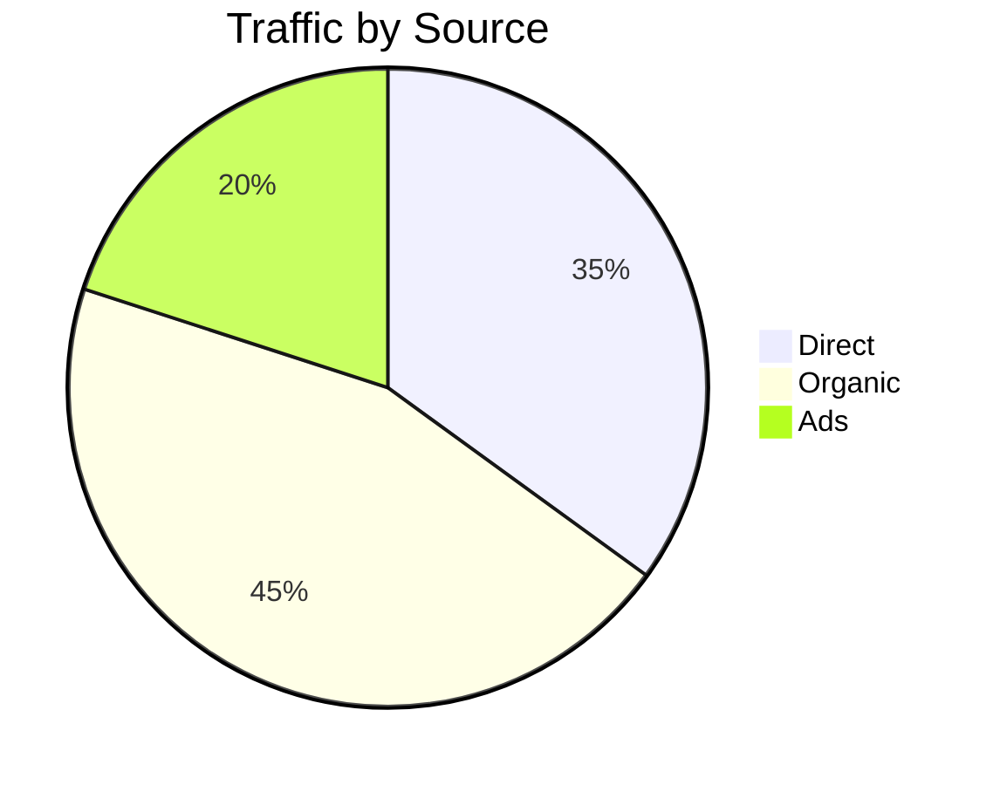

### Quadrant - flowchart fallback

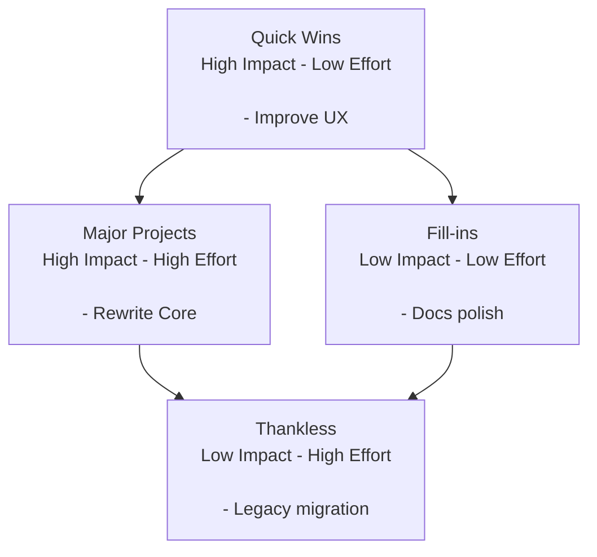

### Requirement - flowchart fallback

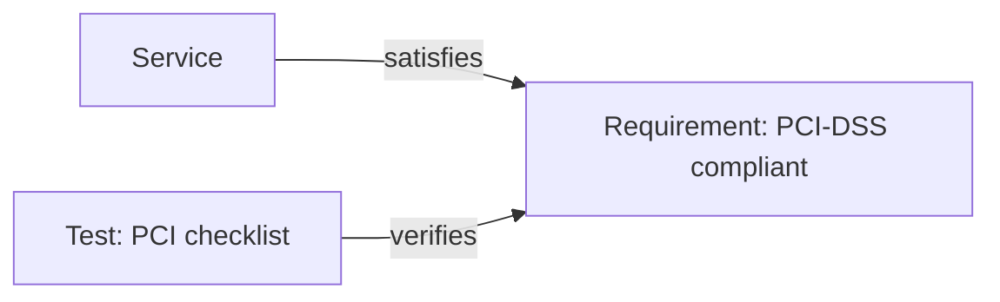

### Sankey - flowchart fallback (веса на ребрах)

```mermaid
graph LR
  Checkout["Checkout"] -->|100| PSP["PSP"]
  PSP -->|60|  Settled["Settled"]
  PSP -->|40|  Declined["Declined"]
```

### Git graph - flowchart fallback (простой DAG)

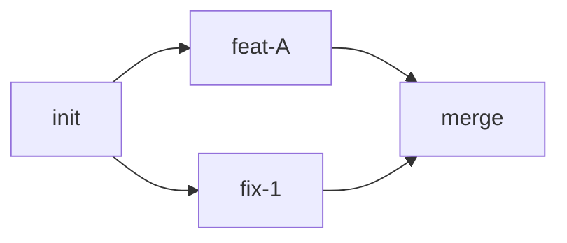

## When to use which diagram

- Flowchart: общие потоки, решения, движение данных в спеках и PRD.
- Sequence: взаимодействия во времени между акторами/сервисами (API, запросы, ответы).
- Class: доменные модели и статическая структура; полезно для атрибутов сущностей и их связей.
- State: жизненный цикл сущности/компонента (idle -> loading -> ready/error, вложенные состояния).
- ER: логическая или БД-модель с кардинальностями.
- Journey: пользовательский опыт по шагам/секциям (приемочные сценарии PRD).
- Gantt: расписание, релизы, зависимости по датам.
- Pie: простые композиции/доли; для точности предпочесть таблицу.
- Quadrant (fallback): матрица приоритизации (Impact/Effort) без поддержки экспериментального chart.
- Requirement (fallback): прослеживаемость требований, тестов и элементов системы.
- Sankey (fallback): относительные объемы вдоль маршрута, когда `sankey` недоступен.
- Git graph (fallback): мелкие DAG ветвлений/мерджей, когда `gitGraph` недоступен.

## Troubleshooting

Если диаграмма не рендерится:

1. Заменить `flowchart` на `graph`, упростить формы.
2. Обернуть тексты узлов в кавычки.
3. Проверить в `https://mermaid.live`, чтобы изолировать окружение.
4. Откатиться к шаблонам выше для максимальной совместимости.
